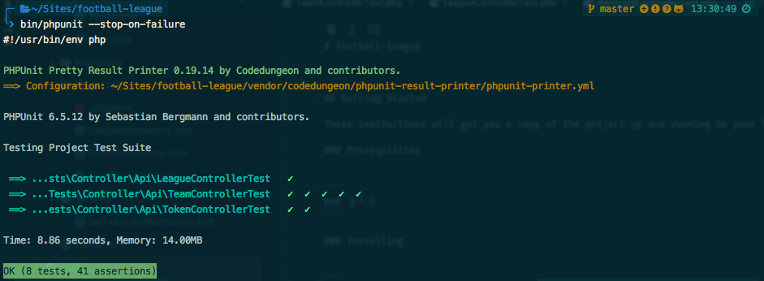

# football-league

A Symfony 4 based RESTful API which is secured with JWT authentication without FOSRestBundle, Nelmio and Swagger. 

## Getting Started

These instructions will get you a copy of the project up and running on your local machine for development and testing purposes. See deployment for notes on how to deploy the project on a live system.

### Prerequisites

```
PHP >=7.0
```

### Installing

```
Composer install
```
```
bin/console doctrine:database:create
bin/console doctrine:schema:create
php bin/console doctrine:fixtures:load
```
```
mkdir config/jwt
openssl genrsa -out config/jwt/private.pem -aes256 4096
openssl rsa -pubout -in config/jwt/private.pem -out config/jwt/public.pem
```

## Running the tests

```
bin/console server:run
bin/phpunit
```



## TODO

* Find an alternative to LexikBundle
* Use a specific SQLite database for tests

## Authors

* **Christopher Arzur** - *Initial work*